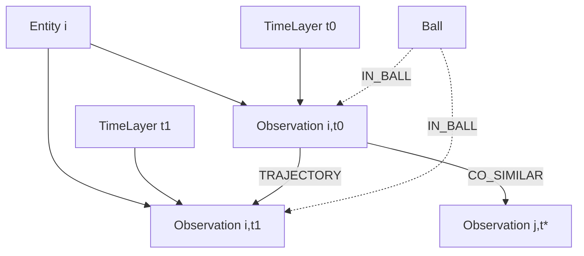
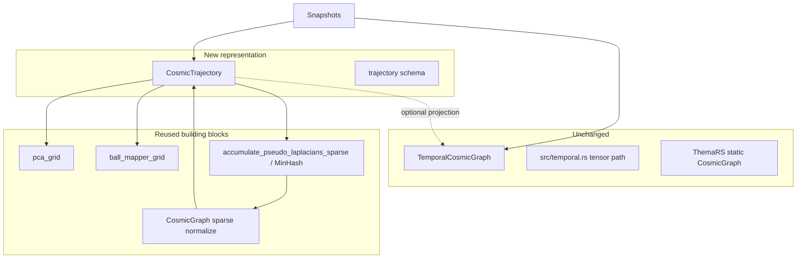

# CosmicTrajectory — Design Spec

**Status:** Implemented (reduced form) — see §16  
**Date:** 2026-08-04  
**Module:** `pulsar.representations.trajectory`  
**Type:** Separate representation (does not modify `TemporalCosmicGraph`)

---

## 1. Motivation

### 1.1 What we have today

[`TemporalCosmicGraph`](../../pulsar/representations/temporal.py) models longitudinal data as a 3D weighted adjacency tensor:

\[
W \in [0,1]^{n \times n \times T}
\]

- **Nodes** are entities (`0 .. n-1`), reused at every time step.
- **Edges** exist only *within* a time slice: `W[i, j, t]` is similarity of entity `i` and `j` at time `t`.
- Construction runs scale → PCA → BallMapper → pseudo-Laplacian **independently per `t`**, then stacks and normalizes ([`from_snapshots`](../../pulsar/representations/temporal.py), Rust helpers in [`src/temporal.rs`](../../src/temporal.rs)).
- Downstream analysis collapses the tensor with aggregations: persistence, mean, recency, volatility, trend, change-point.

This is the right tool for questions like: *which pairs of patients are stably similar across the window?*

### 1.2 What it cannot express

Any question that needs **an observation at time \(t_a\) connected to an observation at time \(t_b\)** is out of scope for the tensor model:

- Patient A at admission similar to Patient B at discharge
- Same patient’s state at \(t\) linked structurally to \(t+1\) (trajectory continuity)
- BallMapper covers that span observations from different times
- A typed, queryable graph (“Neo4j-shaped”) with distinct node/edge kinds

Cross-time connectivity requires a different **node identity**: not entity \(i\), but observation \((i, t)\).

### 1.3 Design stance

| Choice | Decision |
|--------|----------|
| Relation to `TemporalCosmicGraph` | **Keep as-is.** No API breakage, no shared mutable state. |
| New name | **`CosmicTrajectory`** |
| Placement | Sibling under `pulsar.representations` |
| Graph model | Typed property graph + optional hyperedges (Ball covers) |
| Compute substrate | In-memory Pulsar object; Neo4j is an *export target*, not the engine |
| Pairwise cosmic math | Reuse sparse / MinHash cosmic construction on the observation pool |

---

## 2. Goals and non-goals

### 2.1 Goals

1. Represent longitudinal panels as a **typed graph** where any observation can connect to any other.
2. Preserve Pulsar’s native signal: **BallMapper covers** as first-class structure (hyperedges or bipartite Ball nodes), not only pairwise projections.
3. Emit **pairwise cosmic similarity** as a derived edge type (same normalization semantics as `CosmicGraph`).
4. Add explicit **trajectory** edges for same-entity continuity across time.
5. Expose a small, schema-stable surface suitable for NetworkX analysis and later Cypher/CSV export.
6. Remain complementary to `TemporalCosmicGraph` (optional projection back to `(n,n,T)` for parity checks).

### 2.2 Non-goals (v1)

- Replacing or deprecating `TemporalCosmicGraph`
- Wiring into `ThemaRS.fit()` as a default path
- MCP tools / reporting integration
- Live Neo4j dependency or server
- Higher-order Laplacians / sheaf methods on hyperedges
- Automatic entity resolution across misaligned panels
- Streaming / online updates

---

## 3. Conceptual model

### 3.1 Observation-centric identity

Given a balanced panel of \(n\) entities and \(T\) time steps:

\[
\text{obs\_id}(i, t) = t \cdot n + i \quad,\quad N = n \cdot T
\]

Each observation is a node. Entities and time layers are separate typed nodes that observations hang off of.



### 3.2 Two layers of geometry

| Layer | Meaning | Pulsar analogue |
|-------|---------|-----------------|
| **Cover geometry** | Which observations co-inhabit BallMapper balls | BallMapper `.nodes` membership |
| **Pairwise geometry** | Normalized co-membership weights between observation pairs | `CosmicGraph` / pseudo-Laplacian normalize |

`CosmicTrajectory` stores both. Pairwise edges are a 2-section of the cover; they must not be the only representation.

### 3.3 Cross-time connectivity

Cross-time edges arise in two ways:

1. **Structural:** `TRAJECTORY` links same entity across time (always available if panel is aligned).
2. **Geometric:** Global (or multi-scope) BallMapper / cosmic build on the observation pool so `CO_SIMILAR` and `IN_BALL` may join observations with different \(t\).

---

## 4. Schema

Schema is fixed for v1. Types are string labels (Neo4j-compatible). Properties listed are required unless marked optional.

### 4.1 Node types

#### `Entity`

Stable subject (patient, site, unit, …).

| Property | Type | Notes |
|----------|------|-------|
| `entity_id` | int \| str | External id; default = panel row index |
| `label` | str | Optional display name |

#### `TimeLayer`

One time index in the panel.

| Property | Type | Notes |
|----------|------|-------|
| `t` | int | `0 .. T-1` |
| `timestamp` | datetime \| float \| str | Optional real-world time |

#### `Observation`

Entity at a time. Primary analytic node.

| Property | Type | Notes |
|----------|------|-------|
| `obs_id` | int | Internal `t*n + i` |
| `entity_id` | int \| str | FK → Entity |
| `t` | int | FK → TimeLayer |
| `features` | opaque ref | Optional pointer/hash to row features |
| `embedding_ids` | list[str] | Optional refs into cached PCA embeds |

#### `Ball`

One BallMapper cover element (hyperedge materialized as a node).

| Property | Type | Notes |
|----------|------|-------|
| `ball_id` | str | Stable id within build |
| `scope` | str | `"global"` or `"t={k}"` |
| `eps` | float | BallMapper radius |
| `pca_dim` | int | Optional |
| `pca_seed` | int | Optional |
| `size` | int | Membership count |

### 4.2 Edge / relationship types

Undirected unless noted. Multi-edges of different types between the same pair are allowed.

#### `OF_ENTITY` — Observation → Entity

| Property | Type |
|----------|------|
| *(none required)* | |

#### `AT_TIME` — Observation → TimeLayer

| Property | Type |
|----------|------|
| *(none required)* | |

#### `TRAJECTORY` — Observation → Observation (directed: earlier → later)

Same `entity_id`, different `t`.

| Property | Type | Notes |
|----------|------|-------|
| `delta_t` | int | `t_j - t_i` |
| `kind` | str | `"adjacent"` (default) or `"all_pairs"` |

Default construction: **adjacent only** (`t → t+1` per entity).

#### `IN_BALL` — Observation → Ball (or Ball membership hyperedge)

Membership of an observation in a cover element.

| Property | Type | Notes |
|----------|------|-------|
| *(none required)* | | Presence = membership |

**Hypergraph view:** a `Ball` with \(k\) members is a \(k\)-uniform hyperedge via its `IN_BALL` incidence.

#### `CO_SIMILAR` — Observation — Observation (undirected)

Pairwise cosmic weight on the observation pool.

| Property | Type | Notes |
|----------|------|-------|
| `weight` | float | In \((0, 1]\), same semantics as cosmic normalize |
| `scope` | str | `"global"` (v1 default) |
| `cross_time` | bool | `t_i != t_j` |

### 4.3 Schema diagram (Neo4j-style)

```
(:Entity)<-[:OF_ENTITY]-(:Observation)-[:AT_TIME]->(:TimeLayer)
(:Observation)-[:TRAJECTORY]->(:Observation)
(:Observation)-[:IN_BALL]->(:Ball)
(:Observation)-[:CO_SIMILAR {weight, cross_time}]-(:Observation)
```

### 4.4 Invariants

1. Exactly \(N = n \cdot T\) `Observation` nodes for a complete panel.
2. Every `Observation` has exactly one `OF_ENTITY` and one `AT_TIME`.
3. `TRAJECTORY` endpoints share `entity_id` and satisfy `t_src < t_dst`.
4. `CO_SIMILAR.weight > 0`; no self-loops.
5. `IN_BALL` endpoints: Observation + Ball.
6. `ball_id` unique within a build; `obs_id` unique within a build.

---

## 5. Relation to existing Pulsar components



| Component | Role in CosmicTrajectory |
|-----------|--------------------------|
| `pca_grid` / `ball_mapper_grid` | Cover construction on observation features |
| `_CosmicBuilder` / sparse + MinHash | Pairwise `CO_SIMILAR` at scale \(N = nT\) |
| `CosmicGraph.from_pseudo_laplacian_sparse` | Weight formula for pairwise edges |
| `cosmic_to_networkx` | Pattern reference; Trajectory needs typed MultiGraph export |
| `TemporalCosmicGraph` | Sibling; optional sink for intra-time projection |
| `ThemaRS` | Out of scope for v1 |

---

## 6. Construction

### 6.1 Inputs

```python
CosmicTrajectory.from_snapshots(
    snapshots: list[np.ndarray],   # length T; each (n, F_t) or shared F
    config: PulsarConfig,
    *,
    entity_ids: Sequence[Hashible] | None = None,
    timestamps: Sequence | None = None,
    trajectory_mode: Literal["adjacent", "all_pairs"] = "adjacent",
    cosmic_construction: Literal["minhash", "exact"] = "minhash",
    include_intra_time_balls: bool = True,
    similarity_threshold: float = 0.0,
) -> CosmicTrajectory
```

**Preconditions**

- `snapshots` non-empty; all have the same row count `n`.
- Rows are **aligned**: row `i` is the same entity at every `t`.
- Features are either already in a **shared space** across `t`, or the builder applies a documented alignment strategy (see §6.3).

### 6.2 Algorithm

1. **Validate panel** — empty check; consistent `n`; set `entity_ids` default `range(n)`.
2. **Materialize skeleton**
   - Add `Entity`, `TimeLayer`, `Observation` nodes.
   - Add `OF_ENTITY`, `AT_TIME`.
   - Add `TRAJECTORY` edges per `trajectory_mode`.
3. **Optional per-time covers** (`include_intra_time_balls=True`)
   - For each `t`: scale snapshot `t` → `pca_grid` → `ball_mapper_grid`.
   - Map local indices `i` → `obs_id(i,t)`.
   - Create `Ball(scope=f"t={t}", ...)` + `IN_BALL` incidences.
   - *Do not* stop at pairwise-only for these covers.
4. **Global observation pool for cross-time geometry**
   - Build matrix `X_all` of shape `(N, F*)` (§6.3).
   - Scale → `pca_grid` → `ball_mapper_grid` with `config`.
   - Create `Ball(scope="global", ...)` + `IN_BALL`.
5. **Pairwise cosmic**
   - Run sparse exact or MinHash accumulation over global ball maps with node count `N`.
   - Convert to weighted edges; drop weight ≤ `similarity_threshold`.
   - Emit `CO_SIMILAR` with `cross_time = (t_i != t_j)`.
6. **Return** immutable-ish `CosmicTrajectory` holding the typed store + build metadata.

### 6.3 Feature alignment across time

Cross-time BallMapper requires comparable coordinates.

| Strategy | When | Behavior |
|----------|------|----------|
| `shared_columns` (default) | Same feature schema each `t` | Stack rows; fit scaler on pooled `X_all` (or fit once on train window — config later) |
| `per_time_pca_then_stack` | Schema differs or scale drifts | Per-`t` PCA to fixed `d`, concatenate embeddings as rows of `X_all` (columns = PC space, not raw features) |
| `explicit_embeddings` | Caller supplies | `from_embeddings(list[(n,d)])` bypasses raw snapshots for geometry steps |

v1 implements `shared_columns` + `from_embeddings`; `per_time_pca_then_stack` is a documented extension.

### 6.4 Complexity notes

- Dense `(N,N)` is unacceptable for non-trivial \(n,T\). Pairwise path **must** use sparse / MinHash (same rationale as static pipeline `CosmicGraphSpec.construction`).
- Storing all `IN_BALL` incidences is \(O(\sum_c |B_c|)\), typically far smaller than \(O(N^2)\).
- Optional: do not materialize all global `CO_SIMILAR` edges above a weight floor; keep Ball incidence as source of truth and compute pairwise lazily for queries.

---

## 7. Public API (proposed)

### 7.1 Core type

```python
class CosmicTrajectory:
    """Typed longitudinal cosmic representation on observation nodes."""

    n_entities: int
    n_times: int
    n_observations: int  # n_entities * n_times

    # --- construction ---
    @classmethod
    def from_snapshots(...) -> CosmicTrajectory: ...
    @classmethod
    def from_embeddings(...) -> CosmicTrajectory: ...

    # --- typed access ---
    def nodes(self, type: NodeType | None = None) -> Iterable[Node]: ...
    def edges(self, type: EdgeType | None = None) -> Iterable[Edge]: ...
    def balls(self, scope: str | None = None) -> Iterable[BallNode]: ...

    def neighbors(
        self,
        obs_id: int,
        edge_types: Sequence[EdgeType] | None = None,
    ) -> Iterable[tuple[int, Edge]]: ...

    # --- views ---
    def to_networkx(
        self,
        edge_types: Sequence[EdgeType] = ("CO_SIMILAR",),
        *,
        include_nodes: Sequence[NodeType] = ("Observation",),
    ) -> nx.MultiGraph: ...

    def to_temporal_tensor(
        self,
        *,
        edge_type: EdgeType = "CO_SIMILAR",
        fill: float = 0.0,
    ) -> np.ndarray:
        """Project intra-time CO_SIMILAR edges to W[n,n,T] for parity with TemporalCosmicGraph."""

    def observation_index(self, entity_id, t: int) -> int: ...

    # --- export (phase 2) ---
    def to_neo4j_csv(self, directory: Path) -> None: ...
    def iter_cypher(self) -> Iterator[str]: ...
```

### 7.2 Package layout

```
pulsar/representations/
  __init__.py          # export CosmicTrajectory alongside TemporalCosmicGraph
  temporal.py          # UNCHANGED
  trajectory.py        # CosmicTrajectory + builder
  trajectory_schema.py # NodeType / EdgeType enums, validators, property keys
```

Rust: no new crate required for v1 if Python orchestrates existing `ball_mapper_grid` + sparse cosmic APIs. A fused “accumulate on observation ids” helper can land later for performance.

### 7.3 Config

Prefer reusing `PulsarConfig` PCA / BallMapper / cosmic construction knobs. Add an optional nested spec only if needed:

```python
@dataclass
class CosmicTrajectorySpec:
    trajectory_mode: Literal["adjacent", "all_pairs"] = "adjacent"
    include_intra_time_balls: bool = True
    similarity_threshold: float = 0.0
    feature_alignment: Literal["shared_columns", "embeddings"] = "shared_columns"
```

Do not overload `CosmicGraphSpec` with trajectory-only fields.

---

## 8. Queries the schema is meant to answer

Examples (conceptual Cypher / NetworkX filters):

1. **Cross-time lookalikes**  
   Observations with `CO_SIMILAR` where `cross_time=true`, ranked by weight.

2. **Trajectory neighborhood**  
   For entity \(i\), path `Observation(i,t) -TRAJECTORY->*` plus geometric neighbors at each step.

3. **Ball-defined cohorts across time**  
   Members of `Ball(scope="global")` with mixed `t` — natural cross-sectional archetypes that ignore clock alignment.

4. **Intra-time slice**  
   Subgraph of observations with `t=k` and their `CO_SIMILAR` / `IN_BALL` — comparable to one slice of `TemporalCosmicGraph`.

5. **Change focus**  
   Entities whose consecutive observations have low `CO_SIMILAR` to their own prior state but high similarity to another cohort’s later state (transition / switching).

---

## 9. Interop with TemporalCosmicGraph

| Direction | Behavior |
|-----------|----------|
| TCG → Trajectory | Not required. Different node ontology. |
| Trajectory → TCG tensor | `to_temporal_tensor()` keeps only `CO_SIMILAR` with `t_i == t_j`, writes `W[i,j,t]`. Useful for regression tests vs `from_snapshots` when both run on the same per-`t` covers **only** (global covers will diverge — document that). |
| Side-by-side demos | PhysioNet-style demo can build both; label clearly: tensor aggregations vs typed cross-time graph. |

**Parity claim (narrow):** If Trajectory is built with *only* per-time balls and pairwise cosmic accumulated **per `t` then embedded into the observation graph** (no global pool), intra-time weights should match `TemporalCosmicGraph.tensor[:,:,t]` up to sparse/dense construction mode. Global pool builds are a strict superset and will not match TCG.

---

## 10. Storage representation (implementation sketch)

v1 recommended store: simple Python structures, not an embedded graph DB.

```python
@dataclass(frozen=True)
class Node:
    type: NodeType
    id: str | int
    props: dict[str, Any]

@dataclass(frozen=True)
class Edge:
    type: EdgeType
    source: str | int
    target: str | int
    props: dict[str, Any]
    directed: bool

class CosmicTrajectory:
    _nodes: dict[tuple[NodeType, Hashible], Node]
    _edges: list[Edge]
    # adjacency indexes
    _out: dict[Hashible, list[int]]  # edge indices
    _by_type: dict[EdgeType, list[int]]
    _meta: BuildMeta
```

Optional later: `networkx.MultiDiGraph` as the sole store if indexes stay cheap. Prefer keeping a schema-validated store and projecting to NetworkX so invariants are enforced in one place.

---

## 11. Export (phase 2)

### 11.1 Neo4j CSV

Nodes files per label; relationship files per type — standard `neo4j-admin database import` layout.

### 11.2 Cypher stream

`CREATE` / `MERGE` statements for small graphs; not for large \(N\).

### 11.3 Parquet

Entity / Observation / Edge tables for analytics lakes (aligns with existing Pulsar parquet export habits).

---

## 12. Testing strategy

| Test | Intent |
|------|--------|
| Schema invariants | Panel → node/edge counts; one OF_ENTITY / AT_TIME per observation |
| Trajectory wiring | Adjacent mode yields `n*(T-1)` directed edges |
| Cross-time existence | Global build on synthetic migrating clusters produces `CO_SIMILAR` with `cross_time=True` |
| Narrow parity | Per-time-only build matches `TemporalCosmicGraph` slice weights (exact cosmic mode) |
| Sparse scale smoke | `n=200`, `T=10` completes without allocating `(N,N)` dense |
| Export round-trip (phase 2) | CSV headers / row counts |

---

## 13. Phased delivery

### Phase 0 — Spec (this document)

No code.

### Phase 1 — Skeleton + trajectory edges

- Schema module + `CosmicTrajectory` container
- `from_snapshots` builds Entity / TimeLayer / Observation / TRAJECTORY / OF_ENTITY / AT_TIME only
- `to_networkx` for structural edges

### Phase 2 — Covers + cosmic

- Intra-time + global Ball / `IN_BALL`
- Sparse/MinHash `CO_SIMILAR`
- `to_temporal_tensor` narrow parity tests

### Phase 3 — Export + demo

- Neo4j CSV / Parquet
- EHR demo contrasting TCG aggregations vs CosmicTrajectory queries

### Phase 4 — Product integration (optional)

- MCP / ThemaRS hooks, docs user-guide page, config YAML

---

## 14. Open questions

1. **Scaler scope:** Fit `StandardScaler` per time, once on pooled `X_all`, or on a designated baseline window?
2. **Directed clinical time:** Should `CO_SIMILAR` stay undirected while only `TRAJECTORY` carries time direction?
3. **Missing visits:** Support ragged panels (entity absent at some `t`) via optional observations, or require complete panels in v1?
4. **Ball as hyperedge vs node:** Incidence via `Ball` nodes is Neo4j-friendly; a parallel `hyperedges: dict[ball_id, set[obs_id]]` may be better for TDA algorithms — keep both?
5. **Naming bikeshed:** `CosmicTrajectory` vs `TrajectoryGraph` vs `TemporalPropertyGraph` — current pick is `CosmicTrajectory` to signal same family as cosmic graphs.

---

## 15. Summary

`CosmicTrajectory` is a **separate**, observation-centric, typed (hyper)graph representation for longitudinal Pulsar runs. It reuses PCA, BallMapper, and sparse cosmic construction, keeps Ball covers as first-class structure, and allows any observation to connect to any other. [`TemporalCosmicGraph`](../../pulsar/representations/temporal.py) remains the tensor + aggregation API and is not modified by this design.

---

## 16. As built

Implemented in [`pulsar/representations/trajectory.py`](../../pulsar/representations/trajectory.py); tests in [`tests/test_trajectory.py`](../../tests/test_trajectory.py). The delivered form is deliberately narrower than §4–§11.

### Storage: sparse matrices, not a property graph

| Store | Type | Spec equivalent |
|---|---|---|
| `obs` | `pd.DataFrame` (N rows, `obs_id` index) | `Observation` nodes |
| `balls` | `pd.DataFrame` (B rows, `ball_id` index) | `Ball` nodes |
| `similarity` | `sp.csr_matrix` (N, N) symmetric | `CO_SIMILAR` |
| `incidence` | `sp.csr_matrix` (N, B) int8 | `IN_BALL` — the hyperedge incidence |

The module-level `SCHEMA` dict records this mapping so an export layer does not re-derive it.
Hypergraph views are matrix products: `incidence @ incidence.T` (obs–obs co-membership),
`incidence.T @ incidence` (ball–ball overlap), `incidence[:, mask]` (cover sliced by scale).

### Dropped from the spec

- **Typed `Node`/`Edge` store (§10) and `trajectory_schema.py` (§7.2).** A `list[Edge]` of dicts costs roughly 10× CSR for the same data, contradicting the sparse-matrix requirement. The schema lives in the frame columns plus `SCHEMA`.
- **`Entity` / `TimeLayer` nodes and `OF_ENTITY` / `AT_TIME` edges (§4.1–4.2).** Redundant with `obs.entity_id` / `obs.t`; would add `2N` zero-information edges.
- **Per-time covers (`include_intra_time_balls`, §6.2 step 3).** Per-time balls cannot produce a cross-time edge by construction — they only dilute `CO_SIMILAR` toward the tensor answer at ~2× build cost. `TemporalCosmicGraph` already answers intra-time questions.
- **`to_temporal_tensor` and the §9 narrow parity claim.** That parity only holds for per-time-only builds, which are no longer produced. Replaced by a stronger anchor: a `T=1` build must match `ThemaRS` exactly in `construction="exact"` mode (`tests/test_trajectory.py::TestThemaRSParity`). `within_time(t)` remains for slice inspection.
- **Export (§11) and `CosmicTrajectorySpec` (§7.3).** Deferred; construction options are keyword arguments, and `ALLOWED_COSMIC_GRAPH_KEYS` in `config.py` would reject trajectory keys under `cosmic_graph:` anyway.
- **`Ball.pca_seed`.** `BallMapper` exposes only `eps`; `dim` comes from the embedding width. Seed is not recoverable and nothing slices by it.

### Open questions — resolved

1. **Scaler scope:** one `StandardScaler` fit on the pooled `X_all`. Per-`t` refitting (what `temporal.py` does) re-centers every slice and erases exactly the drift that cross-time edges exist to detect. `scale=False` opts out when snapshots are already a shared embedding.
2. **Directed clinical time:** `CO_SIMILAR` is symmetric; only `TRAJECTORY` carries direction, via `trajectory_edges()` returning `(earlier, later)` pairs.
3. **Missing visits:** ragged panels supported. `obs_id` is the stacked row position, not `t*n + i`, so an entity absent at some `t` needs no special case.
4. **Ball as hyperedge vs node:** one CSR incidence serves both — its columns are the hyperedges, and export can emit them as `:Ball` nodes.
5. **Naming:** `CosmicTrajectory`, as specced.

### Known ceiling

`cluster_labels()` is connected components on the thresholded similarity. On a dense-ish
cosmic graph the component count moves steeply with the threshold (2 → ~1100 across
`[0.0, 0.8]` on a 100-patient / 12-hour ICU panel), so the threshold is the operator's
choice, as elsewhere in Pulsar. A k-way alternative would mean the threshold-stability or
spectral paths in `pulsar/mcp/interpreter.py::resolve_clusters`, which are currently
coupled to `ThemaRS` and would need decoupling first.
